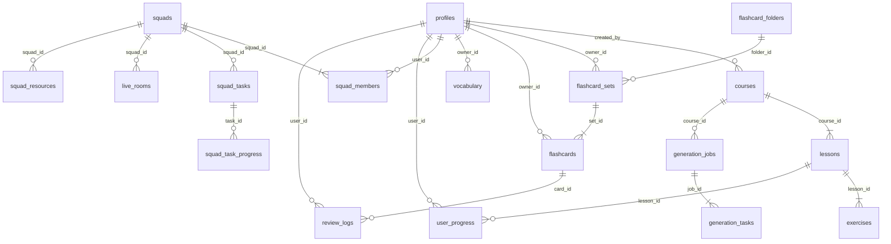

# Database Schema — Talk2Me LearnTube

> Tài liệu đầy đủ cho toàn bộ database schema trên Supabase (PostgreSQL).

---

## ERD Tổng quan



---

## Migration SQL: 001_initial_schema.sql

```sql
-- ================================================
-- ENUMS
-- ================================================
CREATE TYPE job_status AS ENUM ('queued','generating','paused_quota','completed','failed');
CREATE TYPE task_status AS ENUM ('pending','in_progress','done','failed');
CREATE TYPE squad_role AS ENUM ('owner','member');
CREATE TYPE vocab_source AS ENUM ('theory','result','manual');
CREATE TYPE flashcard_status AS ENUM ('new','learning','mastered');

-- ================================================
-- TABLE: profiles
-- Extension của auth.users Supabase
-- ================================================
CREATE TABLE profiles (
  id           uuid PRIMARY KEY REFERENCES auth.users(id) ON DELETE CASCADE,
  username     text UNIQUE NOT NULL,
  avatar_url   text,
  streak_days  int NOT NULL DEFAULT 0,
  created_at   timestamptz NOT NULL DEFAULT now(),
  updated_at   timestamptz NOT NULL DEFAULT now()
);

-- Trigger tự tạo profile khi user đăng ký
CREATE OR REPLACE FUNCTION handle_new_user()
RETURNS TRIGGER AS $$
BEGIN
  INSERT INTO profiles (id, username, avatar_url)
  VALUES (
    NEW.id,
    COALESCE(NEW.raw_user_meta_data->>'full_name', split_part(NEW.email, '@', 1)),
    NEW.raw_user_meta_data->>'avatar_url'
  );
  RETURN NEW;
END;
$$ LANGUAGE plpgsql SECURITY DEFINER;

CREATE TRIGGER on_auth_user_created
  AFTER INSERT ON auth.users
  FOR EACH ROW EXECUTE FUNCTION handle_new_user();

-- ================================================
-- TABLE: courses
-- Cache-key = youtube_video_id (UNIQUE)
-- ================================================
CREATE TABLE courses (
  id               uuid PRIMARY KEY DEFAULT gen_random_uuid(),
  youtube_video_id text UNIQUE NOT NULL,  -- cache key!
  title            text NOT NULL,
  description      text,
  category         text,
  difficulty       text CHECK (difficulty IN ('Beginner','Intermediate','Advanced')),
  thumbnail_url    text,
  channel_name     text,
  duration_text    text,
  is_public        boolean NOT NULL DEFAULT true,
  created_by       uuid REFERENCES profiles(id) ON DELETE SET NULL,
  creation_status  text NOT NULL DEFAULT 'processing'
                   CHECK (creation_status IN ('processing','completed','failed')),
  created_at       timestamptz NOT NULL DEFAULT now()
);

CREATE INDEX idx_courses_video_id ON courses(youtube_video_id);
CREATE INDEX idx_courses_public ON courses(is_public, created_at DESC);

-- ================================================
-- TABLE: lessons
-- ================================================
CREATE TABLE lessons (
  id             uuid PRIMARY KEY DEFAULT gen_random_uuid(),
  course_id      uuid NOT NULL REFERENCES courses(id) ON DELETE CASCADE,
  lesson_index   int NOT NULL,
  title          text NOT NULL,
  start_seconds  int NOT NULL DEFAULT 0,
  end_seconds    int NOT NULL,
  theory_content text,
  key_takeaways  text[] DEFAULT '{}',
  available_modes text[] DEFAULT '{"theory","quiz","dictation","shadowing","writing","speaking"}',
  created_at     timestamptz NOT NULL DEFAULT now(),
  UNIQUE (course_id, lesson_index)
);

CREATE INDEX idx_lessons_course ON lessons(course_id, lesson_index);

-- ================================================
-- TABLE: exercises
-- payload_json giữ QuizQuestion[] / DictationSegment[] / ...
-- ================================================
CREATE TABLE exercises (
  id           uuid PRIMARY KEY DEFAULT gen_random_uuid(),
  lesson_id    uuid NOT NULL REFERENCES lessons(id) ON DELETE CASCADE,
  type         text NOT NULL CHECK (type IN ('quiz','dictation','shadowing','writing','speaking')),
  payload_json jsonb NOT NULL DEFAULT '{}',
  created_at   timestamptz NOT NULL DEFAULT now()
);

CREATE INDEX idx_exercises_lesson ON exercises(lesson_id, type);

-- ================================================
-- FLASHCARD SYSTEM
-- ================================================
CREATE TABLE flashcard_folders (
  id         uuid PRIMARY KEY DEFAULT gen_random_uuid(),
  owner_id   uuid NOT NULL REFERENCES profiles(id) ON DELETE CASCADE,
  name       text NOT NULL,
  color      text DEFAULT '#2E68FF',
  icon       text DEFAULT 'folder',
  created_at timestamptz NOT NULL DEFAULT now()
);

CREATE TABLE flashcard_sets (
  id          uuid PRIMARY KEY DEFAULT gen_random_uuid(),
  folder_id   uuid REFERENCES flashcard_folders(id) ON DELETE SET NULL,
  owner_id    uuid NOT NULL REFERENCES profiles(id) ON DELETE CASCADE,
  title       text NOT NULL,
  description text,
  is_public   boolean NOT NULL DEFAULT false,
  created_at  timestamptz NOT NULL DEFAULT now()
);

CREATE TABLE flashcards (
  id               uuid PRIMARY KEY DEFAULT gen_random_uuid(),
  set_id           uuid REFERENCES flashcard_sets(id) ON DELETE CASCADE,
  owner_id         uuid NOT NULL REFERENCES profiles(id) ON DELETE CASCADE,
  front_text       text NOT NULL,
  back_text        text NOT NULL,
  phonetic         text,
  example_sentence text,
  image_url        text,
  -- SRS (SM-2 algorithm)
  interval_days    int NOT NULL DEFAULT 0,
  ease_factor      numeric(4,2) NOT NULL DEFAULT 2.5,
  repetitions      int NOT NULL DEFAULT 0,
  next_review_date date NOT NULL DEFAULT CURRENT_DATE,
  status           flashcard_status NOT NULL DEFAULT 'new',
  is_starred       boolean NOT NULL DEFAULT false,
  -- VIDEO FLASHCARD (zero storage!)
  source_video_id  text,  -- YouTube video ID
  clip_start_sec   int,   -- start seconds
  clip_end_sec     int,   -- end seconds
  created_at       timestamptz NOT NULL DEFAULT now()
);

CREATE INDEX idx_flashcards_review ON flashcards(owner_id, next_review_date, status);

CREATE TABLE review_logs (
  id          uuid PRIMARY KEY DEFAULT gen_random_uuid(),
  card_id     uuid NOT NULL REFERENCES flashcards(id) ON DELETE CASCADE,
  user_id     uuid NOT NULL REFERENCES profiles(id) ON DELETE CASCADE,
  quality     int NOT NULL CHECK (quality BETWEEN 0 AND 5),
  reviewed_at timestamptz NOT NULL DEFAULT now()
);

CREATE INDEX idx_review_logs_card ON review_logs(card_id, reviewed_at DESC);

-- ================================================
-- VOCABULARY
-- ================================================
CREATE TABLE vocabulary (
  id              uuid PRIMARY KEY DEFAULT gen_random_uuid(),
  owner_id        uuid NOT NULL REFERENCES profiles(id) ON DELETE CASCADE,
  term            text NOT NULL,
  definition      text,
  phonetic        text,
  example_sentence text,
  source_lesson_id uuid REFERENCES lessons(id) ON DELETE SET NULL,
  source_type     vocab_source NOT NULL DEFAULT 'manual',
  saved_at        timestamptz NOT NULL DEFAULT now(),
  UNIQUE (owner_id, term)  -- tránh duplicate
);

-- ================================================
-- COMMUNITY / SQUADS
-- ================================================
CREATE TABLE squads (
  id          uuid PRIMARY KEY DEFAULT gen_random_uuid(),
  name        text NOT NULL,
  description text,
  owner_id    uuid NOT NULL REFERENCES profiles(id) ON DELETE CASCADE,
  invite_code text UNIQUE NOT NULL,
  created_at  timestamptz NOT NULL DEFAULT now()
);

CREATE TABLE squad_members (
  squad_id  uuid NOT NULL REFERENCES squads(id) ON DELETE CASCADE,
  user_id   uuid NOT NULL REFERENCES profiles(id) ON DELETE CASCADE,
  role      squad_role NOT NULL DEFAULT 'member',
  joined_at timestamptz NOT NULL DEFAULT now(),
  PRIMARY KEY (squad_id, user_id)
);

CREATE TABLE squad_resources (
  id            uuid PRIMARY KEY DEFAULT gen_random_uuid(),
  squad_id      uuid NOT NULL REFERENCES squads(id) ON DELETE CASCADE,
  resource_type text NOT NULL CHECK (resource_type IN ('course','flashcard_set')),
  resource_id   uuid NOT NULL,
  added_by      uuid REFERENCES profiles(id) ON DELETE SET NULL,
  added_at      timestamptz NOT NULL DEFAULT now()
);

CREATE TABLE squad_tasks (
  id            uuid PRIMARY KEY DEFAULT gen_random_uuid(),
  squad_id      uuid NOT NULL REFERENCES squads(id) ON DELETE CASCADE,
  title         text NOT NULL,
  resource_type text CHECK (resource_type IN ('lesson','flashcard_set')),
  resource_id   uuid,
  due_date      date,
  created_by    uuid REFERENCES profiles(id) ON DELETE SET NULL,
  created_at    timestamptz NOT NULL DEFAULT now()
);

CREATE TABLE squad_task_progress (
  task_id      uuid NOT NULL REFERENCES squad_tasks(id) ON DELETE CASCADE,
  user_id      uuid NOT NULL REFERENCES profiles(id) ON DELETE CASCADE,
  status       text NOT NULL DEFAULT 'pending' CHECK (status IN ('pending','completed')),
  completed_at timestamptz,
  PRIMARY KEY (task_id, user_id)
);

CREATE TABLE live_rooms (
  id         uuid PRIMARY KEY DEFAULT gen_random_uuid(),
  squad_id   uuid NOT NULL REFERENCES squads(id) ON DELETE CASCADE,
  room_name  text UNIQUE NOT NULL,  -- dùng làm Jitsi room ID
  host_id    uuid REFERENCES profiles(id) ON DELETE SET NULL,
  is_active  boolean NOT NULL DEFAULT true,
  started_at timestamptz NOT NULL DEFAULT now()
);

-- ================================================
-- PROGRESS TRACKING
-- ================================================
CREATE TABLE user_progress (
  user_id    uuid NOT NULL REFERENCES profiles(id) ON DELETE CASCADE,
  lesson_id  uuid NOT NULL REFERENCES lessons(id) ON DELETE CASCADE,
  mode       text NOT NULL CHECK (mode IN ('theory','quiz','dictation','shadowing','writing','speaking')),
  completed  boolean NOT NULL DEFAULT false,
  accuracy   numeric(5,2),  -- 0-100%
  updated_at timestamptz NOT NULL DEFAULT now(),
  PRIMARY KEY (user_id, lesson_id, mode)
);

CREATE INDEX idx_user_progress_user ON user_progress(user_id, completed);

-- ================================================
-- BACKGROUND JOB SYSTEM (P1-S5)
-- ================================================
CREATE TABLE generation_jobs (
  id               uuid PRIMARY KEY DEFAULT gen_random_uuid(),
  course_id        uuid NOT NULL REFERENCES courses(id) ON DELETE CASCADE,
  youtube_video_id text NOT NULL,
  status           job_status NOT NULL DEFAULT 'queued',
  total_units      int NOT NULL DEFAULT 0,
  completed_units  int NOT NULL DEFAULT 0,
  last_error       text,
  next_retry_at    timestamptz,
  created_at       timestamptz NOT NULL DEFAULT now(),
  updated_at       timestamptz NOT NULL DEFAULT now()
);

CREATE INDEX idx_jobs_status_retry ON generation_jobs(status, next_retry_at);

CREATE TABLE generation_tasks (
  id         uuid PRIMARY KEY DEFAULT gen_random_uuid(),
  job_id     uuid NOT NULL REFERENCES generation_jobs(id) ON DELETE CASCADE,
  unit_type  text NOT NULL,   -- 'transcript' | 'lesson' | 'vocab'
  unit_ref   text,            -- e.g. lesson_index "2"
  status     task_status NOT NULL DEFAULT 'pending',
  attempts   int NOT NULL DEFAULT 0,
  updated_at timestamptz NOT NULL DEFAULT now()
);

CREATE INDEX idx_tasks_job_status ON generation_tasks(job_id, status);
```

---

## Row-Level Security (RLS) Policies

```sql
-- Bật RLS cho tất cả tables
ALTER TABLE profiles ENABLE ROW LEVEL SECURITY;
ALTER TABLE courses ENABLE ROW LEVEL SECURITY;
ALTER TABLE lessons ENABLE ROW LEVEL SECURITY;
ALTER TABLE exercises ENABLE ROW LEVEL SECURITY;
ALTER TABLE flashcard_folders ENABLE ROW LEVEL SECURITY;
ALTER TABLE flashcard_sets ENABLE ROW LEVEL SECURITY;
ALTER TABLE flashcards ENABLE ROW LEVEL SECURITY;
ALTER TABLE review_logs ENABLE ROW LEVEL SECURITY;
ALTER TABLE vocabulary ENABLE ROW LEVEL SECURITY;
ALTER TABLE squads ENABLE ROW LEVEL SECURITY;
ALTER TABLE squad_members ENABLE ROW LEVEL SECURITY;
ALTER TABLE squad_tasks ENABLE ROW LEVEL SECURITY;
ALTER TABLE squad_task_progress ENABLE ROW LEVEL SECURITY;
ALTER TABLE live_rooms ENABLE ROW LEVEL SECURITY;
ALTER TABLE user_progress ENABLE ROW LEVEL SECURITY;
ALTER TABLE generation_jobs ENABLE ROW LEVEL SECURITY;
ALTER TABLE generation_tasks ENABLE ROW LEVEL SECURITY;

-- PROFILES: user chỉ xem/sửa profile của mình
CREATE POLICY "profiles_self" ON profiles
  USING (id = auth.uid())
  WITH CHECK (id = auth.uid());

-- COURSES: xem public courses + courses của mình; chỉ tạo/sửa/xóa của mình
CREATE POLICY "courses_read" ON courses FOR SELECT
  USING (is_public = true OR created_by = auth.uid());
CREATE POLICY "courses_write" ON courses FOR ALL
  USING (created_by = auth.uid())
  WITH CHECK (created_by = auth.uid());

-- LESSONS/EXERCISES: ai xem được course thì xem được lessons
CREATE POLICY "lessons_read" ON lessons FOR SELECT
  USING (EXISTS (
    SELECT 1 FROM courses c WHERE c.id = lessons.course_id
    AND (c.is_public = true OR c.created_by = auth.uid())
  ));

CREATE POLICY "exercises_read" ON exercises FOR SELECT
  USING (EXISTS (
    SELECT 1 FROM lessons l JOIN courses c ON c.id = l.course_id
    WHERE l.id = exercises.lesson_id
    AND (c.is_public = true OR c.created_by = auth.uid())
  ));

-- FLASHCARDS: chỉ xem/sửa của mình hoặc public sets
CREATE POLICY "flashcard_sets_read" ON flashcard_sets FOR SELECT
  USING (owner_id = auth.uid() OR is_public = true);
CREATE POLICY "flashcard_sets_write" ON flashcard_sets FOR ALL
  USING (owner_id = auth.uid());

CREATE POLICY "flashcards_own" ON flashcards FOR ALL
  USING (owner_id = auth.uid());

-- SQUADS: thành viên xem squad của mình
CREATE POLICY "squads_member_read" ON squads FOR SELECT
  USING (EXISTS (
    SELECT 1 FROM squad_members sm
    WHERE sm.squad_id = squads.id AND sm.user_id = auth.uid()
  ));
CREATE POLICY "squads_owner_write" ON squads FOR ALL
  USING (owner_id = auth.uid());

-- USER_PROGRESS: chỉ của mình
CREATE POLICY "progress_own" ON user_progress FOR ALL
  USING (user_id = auth.uid());

-- GENERATION_JOBS: chỉ owner của course
CREATE POLICY "jobs_own" ON generation_jobs FOR ALL
  USING (EXISTS (
    SELECT 1 FROM courses c WHERE c.id = generation_jobs.course_id
    AND c.created_by = auth.uid()
  ));
```

---

## Sample Data (cho testing)

```sql
-- Chạy sau khi đã có user thật trong auth.users

-- INSERT profile test (thường tự tạo qua trigger)
-- INSERT vào course mẫu
INSERT INTO courses (youtube_video_id, title, description, category, difficulty, thumbnail_url, channel_name, is_public, creation_status)
VALUES (
  'dQw4w9WgXcQ',
  'English for Everyone: Business Communication',
  'Master professional English through real YouTube content',
  'Business English',
  'Intermediate',
  'https://img.youtube.com/vi/dQw4w9WgXcQ/hqdefault.jpg',
  'English Academy',
  true,
  'completed'
);

-- Lấy ID course vừa tạo
DO $$
DECLARE
  v_course_id uuid;
  v_lesson_id uuid;
BEGIN
  SELECT id INTO v_course_id FROM courses WHERE youtube_video_id = 'dQw4w9WgXcQ';

  -- INSERT lesson mẫu
  INSERT INTO lessons (course_id, lesson_index, title, start_seconds, end_seconds, theory_content, key_takeaways)
  VALUES (
    v_course_id, 1,
    'Introduction to Business Email Writing',
    0, 480,
    '## Business Email Essentials\n\nEffective business emails are **clear**, **concise**, and **professional**...',
    ARRAY['Always use a clear subject line', 'Keep emails under 200 words', 'End with a call to action']
  ) RETURNING id INTO v_lesson_id;

  -- INSERT exercises
  INSERT INTO exercises (lesson_id, type, payload_json)
  VALUES
    (v_lesson_id, 'quiz', '[
      {
        "id": "q1",
        "question": "What is the most important element of a business email?",
        "options": ["Length", "Clear subject line", "Attachments", "CC list"],
        "correctAnswer": 1,
        "explanation": "A clear subject line ensures your email gets opened and understood immediately."
      }
    ]'::jsonb),
    (v_lesson_id, 'writing', '{
      "id": "w1",
      "promptText": "Write a professional email requesting a meeting with a client.",
      "suggestedWordCount": 150,
      "sampleAnswer": "Dear Mr. Smith,\n\nI hope this message finds you well..."
    }'::jsonb);
END $$;

-- INSERT flashcard set mẫu
-- (Cần có user_id thật - thay 'your-user-uuid' bằng UUID thật)
-- INSERT INTO flashcard_sets (owner_id, title, description, is_public)
-- VALUES ('your-user-uuid', 'Business Vocabulary', 'Key business terms', true);
```

---

## Atomic Task Claim (chống race condition)

Dùng khi background job cần claim task (tránh 2 worker cùng xử lý 1 task):

```sql
UPDATE generation_tasks
SET    status = 'in_progress', attempts = attempts + 1, updated_at = now()
WHERE  id = (
  SELECT id FROM generation_tasks
  WHERE  job_id = $1 AND status = 'pending'
  ORDER  BY created_at
  FOR UPDATE SKIP LOCKED   -- worker khác skip hàng đã bị lock
  LIMIT  1
)
RETURNING *;
-- Không có row trả về = không còn task pending
```
