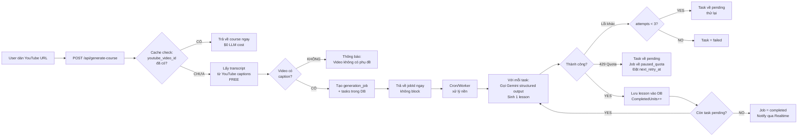

# Module: Course Generation Agent

> Xây dựng pipeline sinh khóa học từ YouTube URL — trái tim của Talk2Me LearnTube.

---

## Flow Tổng quan



---

## Bước 1: Lấy YouTube Transcript

```typescript
// api/services/youtube-transcript.ts

import { YoutubeTranscript } from 'youtube-transcript';

export interface TranscriptSegment {
  text: string;
  startSec: number;
  endSec: number;
}

export async function fetchTranscript(videoId: string): Promise<TranscriptSegment[]> {
  try {
    const raw = await YoutubeTranscript.fetchTranscript(videoId, {
      lang: 'en',  // ưu tiên tiếng Anh
    });
    
    return raw.map(item => ({
      text: item.text.replace(/\n/g, ' ').trim(),
      startSec: Math.floor(item.offset / 1000),
      endSec: Math.floor((item.offset + item.duration) / 1000),
    }));
  } catch (err) {
    // Thử tiếng Việt nếu không có tiếng Anh
    const rawVi = await YoutubeTranscript.fetchTranscript(videoId, { lang: 'vi' });
    if (!rawVi?.length) {
      throw new Error('NO_CAPTIONS: Video này không có phụ đề tự động');
    }
    return rawVi.map(item => ({
      text: item.text.replace(/\n/g, ' ').trim(),
      startSec: Math.floor(item.offset / 1000),
      endSec: Math.floor((item.offset + item.duration) / 1000),
    }));
  }
}
```

---

## Bước 2: Chia Transcript thành Segments

```typescript
// Chia transcript thành N lessons theo thời gian đều nhau
function splitTranscriptIntoLessons(
  transcript: TranscriptSegment[],
  targetLessonCount: number = 3
): TranscriptSegment[][] {
  const totalDuration = transcript[transcript.length - 1]?.endSec ?? 0;
  const lessonDuration = totalDuration / targetLessonCount;
  
  const lessons: TranscriptSegment[][] = Array.from({ length: targetLessonCount }, () => []);
  
  for (const segment of transcript) {
    const lessonIndex = Math.min(
      Math.floor(segment.startSec / lessonDuration),
      targetLessonCount - 1
    );
    lessons[lessonIndex].push(segment);
  }
  
  return lessons.filter(l => l.length > 0);
}
```

---

## Bước 3: Sinh nội dung lesson bằng Gemini Structured Output

**Sample Input (gửi cho Gemini):**
```
Video ID: dQw4w9WgXcQ
Lesson 1 (0:00 - 8:00)
Transcript:
"Welcome to this business email writing course. Today we'll cover the fundamentals 
of professional communication. [00:15] A business email has three core components: 
a clear subject line, a professional greeting, and a concise body..."

Task: Generate a complete lesson including theory, quiz questions, dictation segments,
shadowing lines, writing prompt, and speaking prompt.
```

**JSON Schema gửi cho Gemini:**
```typescript
const lessonSchema = {
  type: Type.OBJECT,
  properties: {
    title: { type: Type.STRING },
    theoryContent: { type: Type.STRING },  // Markdown
    keyTakeaways: { type: Type.ARRAY, items: { type: Type.STRING } },
    quizQuestions: {
      type: Type.ARRAY,
      minItems: 3,
      maxItems: 5,
      items: {
        type: Type.OBJECT,
        properties: {
          question: { type: Type.STRING },
          options: { type: Type.ARRAY, items: { type: Type.STRING } },
          correctAnswer: { type: Type.INTEGER },
          explanation: { type: Type.STRING },
        }
      }
    },
    dictationSegments: {
      type: Type.ARRAY,
      minItems: 2,
      items: {
        type: Type.OBJECT,
        properties: {
          startTime: { type: Type.NUMBER },
          endTime: { type: Type.NUMBER },
          targetText: { type: Type.STRING },
          translationText: { type: Type.STRING },
          hintKeyWords: { type: Type.ARRAY, items: { type: Type.STRING } },
        }
      }
    },
    shadowingLines: {
      type: Type.ARRAY,
      minItems: 2,
      items: {
        type: Type.OBJECT,
        properties: {
          startTime: { type: Type.NUMBER },
          endTime: { type: Type.NUMBER },
          sampleText: { type: Type.STRING },
          phoneticText: { type: Type.STRING },
        }
      }
    },
    writingPrompt: {
      type: Type.OBJECT,
      properties: {
        promptText: { type: Type.STRING },
        suggestedWordCount: { type: Type.INTEGER },
        sampleAnswer: { type: Type.STRING },
      }
    },
    speakingPrompts: {  // Mảng (khác với prototype!)
      type: Type.ARRAY,
      minItems: 2,
      maxItems: 3,
      items: {
        type: Type.OBJECT,
        properties: {
          promptText: { type: Type.STRING },
          phoneticGuide: { type: Type.STRING },
        }
      }
    }
  },
  required: ['title', 'theoryContent', 'quizQuestions', 'dictationSegments']
};
```

**Sample Output từ LLM:**
```json
{
  "title": "Business Email Fundamentals",
  "theoryContent": "## Professional Email Structure\n\nA well-written business email has three essential components:\n\n### 1. Clear Subject Line\nYour subject line is the **first impression**...",
  "keyTakeaways": [
    "Subject lines should be specific and action-oriented",
    "Keep the body under 200 words",
    "Always end with a clear call to action"
  ],
  "quizQuestions": [
    {
      "question": "What should a good email subject line be?",
      "options": ["Long and detailed", "Specific and action-oriented", "Generic", "Optional"],
      "correctAnswer": 1,
      "explanation": "A specific subject line helps the recipient understand the email's purpose immediately."
    }
  ],
  "dictationSegments": [
    {
      "startTime": 15.2,
      "endTime": 22.8,
      "targetText": "A business email has three core components: a clear subject line, a professional greeting, and a concise body.",
      "translationText": "Một email công việc có ba thành phần cốt lõi: tiêu đề rõ ràng, lời chào chuyên nghiệp, và nội dung súc tích.",
      "hintKeyWords": ["components", "subject", "greeting", "concise"]
    }
  ],
  "shadowingLines": [
    {
      "startTime": 15.2,
      "endTime": 22.8,
      "sampleText": "A business email has three core components.",
      "phoneticText": "/ə ˈbɪznɪs ˈiːmeɪl hæz θriː kɔːr kəmˈpoʊnənts/"
    }
  ],
  "writingPrompt": {
    "promptText": "Write a professional email to your manager requesting a day off.",
    "suggestedWordCount": 150,
    "sampleAnswer": "Dear [Manager's Name],\n\nI hope this message finds you well. I would like to request..."
  },
  "speakingPrompts": [
    {
      "promptText": "Describe the key elements of an effective business email in 30 seconds.",
      "phoneticGuide": "Focus on: subject line /ˈsʌbdʒɪkt laɪn/, greeting /ˈɡriːtɪŋ/, concise /kənˈsaɪs/"
    }
  ]
}
```

---

## Bước 4: Checkpoint + Retry System

```typescript
// api/services/job-processor.ts

async function processNextTask(jobId: string): Promise<void> {
  // 1. Claim task nguyên tử (chống race condition)
  const { data: task } = await supabase.rpc('claim_next_task', { p_job_id: jobId });
  if (!task) {
    // Không còn task pending → job hoàn thành
    await supabase.from('generation_jobs')
      .update({ status: 'completed', updated_at: new Date().toISOString() })
      .eq('id', jobId);
    return;
  }
  
  try {
    // 2. Xử lý task (gọi LLM)
    const result = await generateLesson(task.unit_ref, task.job_id);
    
    // 3. Lưu kết quả
    await saveLessonToDb(result, task.unit_ref);
    
    // 4. Mark task done
    await supabase.from('generation_tasks')
      .update({ status: 'done', updated_at: new Date().toISOString() })
      .eq('id', task.id);
    
    // 5. Tăng completed_units
    await supabase.rpc('increment_completed_units', { p_job_id: jobId });
    
  } catch (err: any) {
    if (err.status === 429) {
      // Hết quota: task về pending, job về paused
      const retryAfter = parseInt(err.headers?.['retry-after'] ?? '3600');
      
      await supabase.from('generation_tasks')
        .update({ status: 'pending', updated_at: new Date().toISOString() })
        .eq('id', task.id);
      
      await supabase.from('generation_jobs')
        .update({
          status: 'paused_quota',
          last_error: err.message,
          next_retry_at: new Date(Date.now() + retryAfter * 1000).toISOString(),
        })
        .eq('id', jobId);
    } else {
      // Lỗi khác: tăng attempts
      const newAttempts = (task.attempts ?? 0) + 1;
      await supabase.from('generation_tasks')
        .update({
          status: newAttempts >= 3 ? 'failed' : 'pending',
          attempts: newAttempts,
          updated_at: new Date().toISOString(),
        })
        .eq('id', task.id);
    }
  }
}
```

---

## Learning Checkpoint cho Junior

> **Tại sao cần Background Job thay vì chờ trong request?**
>
> Sinh một khóa 3 bài học tốn khoảng 30-60 giây. Nếu chờ trong request:
> - Browser timeout sau 30s
> - Cloudflare Workers timeout sau 50ms CPU time
> - User không thể dùng app trong lúc chờ
>
> **Giải pháp Background Job:**
> 1. Request trả về ngay (< 1s) với jobId
> 2. Công việc thật chạy nền qua Cron
> 3. Client subscribe Supabase Realtime để nhận updates
>
> Đây là pattern phổ biến trong production apps: "fire and forget with status tracking"
